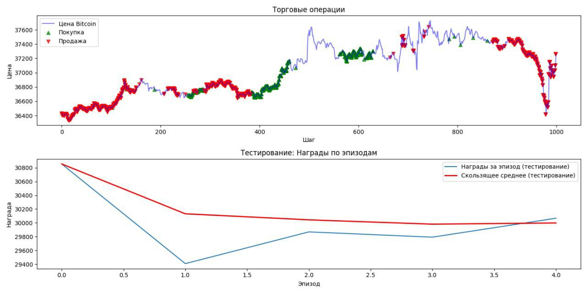

# DQN Торговый Агент для Криптовалюты Bitcoin

Этот репозиторий содержит код для обучения и тестирования агента с использованием метода Deep Q-Network (DQN) для торговли криптовалютой Bitcoin.

## Описание

`main.py` включает в себя процесс подготовки данных, инициализацию торговой среды, создание экземпляра DQN агента, а также его обучение и визуализацию результатов.

## Установка

Для работы с проектом установите следующие библиотеки:
- `numpy`
- `pandas`
- `matplotlib`
- `torch`

Используйте команду для установки:

```pip install numpy pandas matplotlib torch```


## Использование

Для запуска агента используйте:

```python main.py```


## Визуализация Результатов

После завершения обучения агента результаты можно визуализировать с помощью графиков. Ниже представлены примеры графиков, показывающих процесс обучения и тестирования агента.



## Структура Проекта

- `components/` - содержит основные модули проекта:
  - `data/` - модуль для подготовки данных.
  - `gym_env/` - торговая среда для агента.
  - `dqn/` - реализация агента DQN.
  - `tools/` - вспомогательные утилиты для обучения и визуализации результатов.

